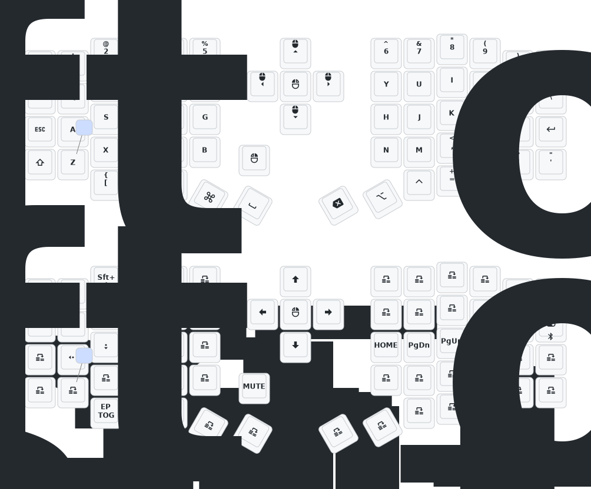

# Eyelash Sofle ZMK

Firmware and Keymap

> [!CAUTION]
> If you flash your device you do so **AT YOUR OWN RISK**.
> 
> Make sure you have backup firmware in case this is not compatible with your board.

## Setup

1. [Create a new repository from this template](https://github.com/new?template_name=zmk-sofle&template_owner=cybardev)
1. Navigate to the newly created repo under your own account and continue reading there
1. Go to the [Actions tab](../../actions)
1. Enable Actions on your repo
1. Go to [Nick Coutsos' Keymap Editor](https://nickcoutsos.github.io/keymap-editor/) and link your repo
   - **PS**: allow access to **ONLY** your newly created config repo, **NOT** all repos
1. Edit the keymap how you want and save
1. Check the artifacts of the [Build ZMK firmware](../../actions/workflows/build.yml) workflow that runs and completes
1. Download `firmware.zip` and extract it on your computer
1. Connect the right half of your keyboard via USB to your computer
1. Press the reset button on the side or under your connected keyboard _twice_
1. Drag and drop `settings_reset-nice_nano_v2-zmk.uf2` onto the portable USB drive that appears and wait for it to disappear
1. Press the reset button on the side or under your connected keyboard _twice_ again
1. Drag and drop `nice_view-eyelash_sofle_right-zmk.uf2` onto the portable USB drive that appears and wait for it to disappear
1. Disconnect the right half of your keyboard from the computer
1. Connect the left half of your keyboard via USB to your computer
1. Press the reset button on the side or under your connected keyboard _twice_
1. Drag and drop `settings_reset-nice_nano_v2-zmk.uf2` onto the portable USB drive that appears and wait for it to disappear
1. Press the reset button on the side or under your connected keyboard _twice_ again
1. Drag and drop `eyelash_sofle_studio_left.uf2` onto the portable USB drive that appears and wait for it to disappear
1. Disconnect the left half of your keyboard from the computer
1. Flip the power switch on each side of your keyboard to the ON position
1. Open your device's Bluetooth settings and look for "Eyelash Sofle" and connect to it
1. ✨ **DONE** ✨ Your keyboard is now ready for use

> [!NOTE]
> ### Charging indicators:
> | Light               |                               State |
> | :------------------ | ----------------------------------: |
> | static GREEN        |        battery connected + charging |
> | flashing GREEN/BLUE | battery disconnected + NOT charging |
> | lights OFF          |                   charging complete |

## Keymap

